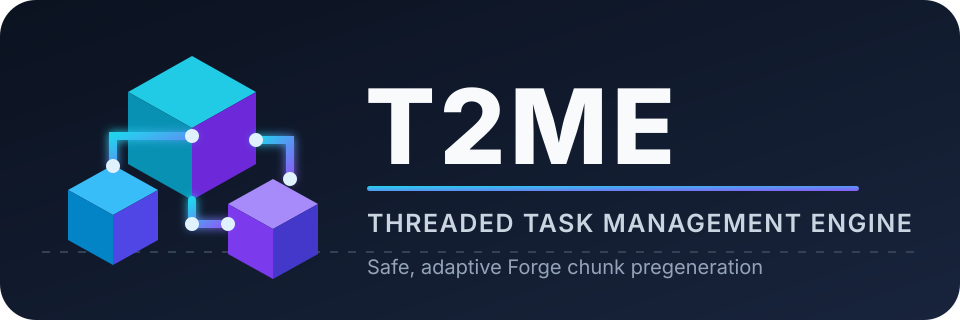

<p align="center">
  
</p>

<h1 align="center">T2ME - Threaded Task Management Engine</h1>

[](https://github.com/MimoAlexer/T2ME/actions/workflows/ci.yml?query=branch%3Adev)
[](https://www.minecraft.net/)
[](https://files.minecraftforge.net/net/minecraftforge/forge/index_1.20.1.html)
[](https://adoptium.net/temurin/releases/?version=17)
[](docs/BENCHMARKING.md)
[](LICENSE)

T2ME is an experimental, server-side chunk engine and pregenerator for
Minecraft Forge 1.20.1. Version `0.2.0-dev.1` combines:

- a high-throughput, batched `FULL`-chunk request pipeline;
- an adaptive request window that searches for peak throughput;
- a stage-aware worker pool for selected world-generation stages;
- non-blocking coordinate locks for stages that need exclusion;
- persistent, resumable circle and square jobs; and
- readable chat output plus a live progress boss bar.

The development objective is explicit: **complete the same pregeneration
workload faster than Chunky on the target Forge modpack**. That is a target,
not a measured result. T2ME will not claim a speed win until it beats Chunky
by at least 10% median throughput under the controlled protocol in
[Benchmarking](docs/BENCHMARKING.md), while also passing world-integrity and
server-health checks.

> [!CAUTION]
> This is the experimental `dev` branch. It changes Minecraft's chunk-status
> scheduling path through Mixins and has not passed the release benchmark
> gate. Build and test it only on disposable world copies. Do not install this
> branch on a production server.

## What changed in 0.2 dev

### Batched adaptive scheduler

T2ME admits up to 64 new chunk requests in one tick by default. It adds the
batch's region tickets first, runs one distance-manager update, then obtains
the corresponding `FULL` futures directly on the server thread. Future
callbacks publish small immutable completion events to a multi-producer,
single-consumer queue; the server thread drains that queue in a bounded batch
at the start of the next tick.

The request window starts at 64, searches upward toward a default maximum of
384, and uses additive-increase/multiplicative-decrease control. It backs off
under MSPT or heap pressure and remembers a previously productive window.
The window is a number of pipelined chunk futures, **not** a number of threads.

### Scoped stage-aware world generation

While a T2ME job is running, generation work inside that job's region (plus a
12-chunk dependency margin) can use a dedicated fixed-size worker pool. The
default threaded stages are:

- `BIOMES`
- `NOISE`
- `SURFACE`
- `CARVERS`
- `SPAWN`

Lighting and `FULL` conversion stay on the native Forge path. Structure
threading and `FEATURES` threading are independent, opt-in development
switches because modded generators often retain mutable state in those
stages. `FEATURES`, when enabled, uses a radius-one neighborhood lock.

This design is informed by public ideas in C2ME and Moonrise, but it is an
independent Forge 1.20.1 implementation. It does not embed, shade, translate,
or redistribute their code. See [Third-party notices](THIRD_PARTY_NOTICES.md).

### Readable in-game progress

`/t2me status`, `/t2me metrics`, and `/t2me config show` now use styled,
multi-line output with separate progress, region, speed, work, engine, and
scheduler sections.

The boss bar is enabled for all players by default and shows percentage,
completed/target chunks, current chunks per second, ETA, and active requests.
Its colors communicate state:

| Color | Meaning |
| --- | --- |
| Blue | Running |
| Yellow | Paused or admission throttled |
| Green | Completed |
| White | Cancelled |
| Red | Failed |

A terminal result remains visible for 10 seconds. Operators can restrict the
bar to permissioned players or disable it in the server config.

## Requirements

| Component | Version |
| --- | --- |
| Minecraft | 1.20.1 |
| Forge | 47.4.21 |
| Java | 17 |
| Side | Dedicated or integrated server |
| Current status | Experimental development build |

T2ME has no required third-party mod dependency. Do not run T2ME and another
pregenerator over the same world at the same time.

## Development installation

1. Make and verify an offline backup.
2. Clone a separate copy of the world for testing.
3. Check out the `dev` branch and build with Java 17.
4. Stop the test server.
5. Place the reobfuscated JAR from `build/libs/` in the test server's `mods`
   directory.
6. Remove or disable other active pregenerators for the T2ME run.
7. Start the test server and inspect `/t2me config show` before starting work.

Forge creates the configuration at:

```text
<world>/serverconfig/t2me-server.toml
```

T2ME is server-side only. Players do not need its JAR.

## Quick start

Generate a circle with a 10,000-block radius around the overworld's current
shared spawn:

```mcfunction
/t2me pregen start 10000 circle
```

Monitor the job:

```mcfunction
/t2me status
/t2me metrics
```

Pause and resume:

```mcfunction
/t2me pregen pause
/t2me pregen resume
```

Only one T2ME job can be active or paused at a time.

## Commands

Commands require permission level `4` by default.

| Command | Description |
| --- | --- |
| `/t2me pregen start <radiusBlocks> [circle\|square]` | Start at the overworld's current shared spawn. |
| `/t2me pregen startat <dimension> <centerX> <centerZ> <radiusBlocks> [circle\|square]` | Start at explicit block coordinates in a loaded dimension. |
| `/t2me pregen pause` | Stop admitting new work while preserving the job. |
| `/t2me pregen resume` | Resume a paused job if the compatibility guard permits it. |
| `/t2me pregen cancel` | Release T2ME tickets and cancel the current job. |
| `/t2me pregen status` | Show the same detailed view as `/t2me status`. |
| `/t2me status` | Show progress, region, speed, ETA, active work, engine state, and scheduler state. |
| `/t2me metrics` | Add latency, lock, worker, MSPT, and queue details. |
| `/t2me config show` | Show the active development performance profile. |

`radiusBlocks` must be from `16` through `20,000`, and the whole region must
remain inside Minecraft's safe coordinate range. For example:

```mcfunction
/t2me pregen startat minecraft:the_nether 0 0 5000 square
```

## Development defaults

These settings favor offline throughput. They are not universal tuning advice.
When every old scheduler value still exactly matches the 0.1 defaults, T2ME
migrates that untouched legacy profile to the values below. If any legacy
performance value was customized, it preserves the whole profile for the
operator to review manually.

| Key | Default | Range | Effect |
| --- | ---: | ---: | --- |
| `scheduler.minInFlight` | `32` | `1-512` | Minimum adaptive request window. |
| `scheduler.initialInFlight` | `64` | `1-1024` | Window used when the controller starts. |
| `scheduler.maxInFlight` | `384` | `1-2048` | Configured upper request-window bound. A heap-derived cap can lower it. |
| `scheduler.maxDispatchPerTick` | `64` | `1-512` | Maximum ticket/future admissions in one batch. |
| `scheduler.maxCompletionsPerTick` | `1024` | `16-8192` | Maximum queued completion events applied per tick. |
| `scheduler.controlIntervalTicks` | `20` | `5-200` | Adaptive-window update interval. |
| `scheduler.targetTickMillis` | `48` | `20-100` | Begin multiplicative backoff above this tick EWMA. |
| `scheduler.hardStopTickMillis` | `65` | `30-200` | Stop admission above this tick EWMA. |
| `scheduler.minHeapHeadroomMiB` | `512` | `256-8192` | Stop admission below this max-heap headroom. |
| `scheduler.stallTimeoutSeconds` | `120` | `30-3600` | Requeue active work and pause when the oldest request reaches this age. |
| `scheduler.reduceWhenPlayersOnline` | `false` | boolean | Optionally halve admission when players are online. |
| `threadedWorldgen.enabled` | `true` | boolean | Use the scoped stage-aware worker pool. |
| `threadedWorldgen.threads` | `0` | `0-64` | Worker count; `0` selects available processors minus one, with bounds. |
| `threadedWorldgen.structures` | `false` | boolean | Thread structure stages. Experimental and opt-in. |
| `threadedWorldgen.features` | `false` | boolean | Thread `FEATURES` under radius-one locks. Highest-risk option. |
| `job.maxRetries` | `2` | `0-10` | Retries per failed coordinate before pausing. |
| `job.saveIntervalTicks` | `100` | `20-1200` | Periodic persisted job snapshot interval. |
| `job.progressLogIntervalSeconds` | `60` | `0-3600` | Periodic progress log interval; `0` disables it. |
| `job.autoResume` | `true` | boolean | Resume a cleanly interrupted running job after 200 ticks. |
| `job.allowCompetingPregenerators` | `false` | boolean | Override the compatibility guard. |
| `display.showBossBar` | `true` | boolean | Show the live progress boss bar. |
| `display.bossBarAllPlayers` | `true` | boolean | Show it to all players instead of permissioned operators only. |
| `display.bossBarUpdateTicks` | `10` | `5-200` | Boss-bar refresh interval. |
| `permissionLevel` | `4` | `0-4` | Required permission level for `/t2me`. |

## Safety and compatibility

The dev engine deliberately limits its changed scheduling scope:

- stage redirection is active only while a T2ME job is running and only in
  that dimension and region plus its dependency margin;
- T2ME never implements custom region-file writes;
- lighting and `FULL` conversion remain native;
- completion events mutate tickets and job state only on the server thread;
- ticket identity includes the job and issuance, so late callbacks cannot
  complete a newer request; and
- failures are retried or visibly retained when the job pauses.

These controls reduce risk; they do not prove compatibility with every
world-generation mod. Structure and feature threading remain disabled until
the target pack passes parity testing.

T2ME blocks `start` and `resume` by default when it detects Chunky, C2ME,
C2ME Forge, Chunk Pregenerator, Dimensional Threading, or MCMT. Canary and
ModernFix are reported but do not block startup.

Read [Architecture](docs/ARCHITECTURE.md) for the exact thread and lock
ownership model.

## Is T2ME faster than Chunky?

Not proven yet.

The 0.2 dev architecture removes several avoidable scheduler bottlenecks and
can expose substantially more world-generation parallelism than the 0.1
pipeline. Its default request window is also larger than the 50-future default
visible in the cited Chunky
[`GenerationTask` snapshot](https://github.com/pop4959/Chunky/blob/ab45b8b3a4ada40f69fbdb3af63d2a7004ce82a1/common/src/main/java/org/popcraft/chunky/GenerationTask.java#L25).
Those facts make a win plausible, but queue depth is not throughput and a
larger window can become slower through contention, garbage collection, or
storage saturation.

The only accepted answer is a repeatable A/B result. T2ME must achieve at
least a 10% median throughput win over Chunky across at least three paired
runs, with equal work, no generation errors, acceptable MSPT, and semantic
world parity. See [Benchmarking](docs/BENCHMARKING.md).

For a one-to-one scope comparison with Chunky, Lithium, C2ME, Noisium, and
Moonrise, see [Comparison](docs/COMPARISON.md).

## Build and test

Use a Java 17 JDK:

```powershell
git clone https://github.com/MimoAlexer/T2ME.git
cd T2ME
git switch dev
.\gradlew.bat clean test build
```

Linux and macOS:

```bash
git clone https://github.com/MimoAlexer/T2ME.git
cd T2ME
git switch dev
./gradlew clean test build
```

The production JAR is written to `build/libs/`.

## Project status

`0.2.0-dev.1` is a development candidate, not a release. The next release
requires:

1. successful compile, unit, and integration validation;
2. modpack-specific generation parity checks;
3. controlled crash/restart recovery testing;
4. the documented 10% median Chunky throughput win; and
5. no unacceptable MSPT, heap, GC, disk, or error regression.

Report defects with the T2ME commit, Forge version, mod list, configuration,
`/t2me status`, `/t2me metrics`, benchmark run identifier, and relevant log:
[open an issue](https://github.com/MimoAlexer/T2ME/issues).

## License

T2ME is available under the [MIT License](LICENSE). External projects cited
for comparison or architectural context are independent works under their own
licenses. No external project code or binary is included in T2ME. Details are
in [Third-party notices](THIRD_PARTY_NOTICES.md).
