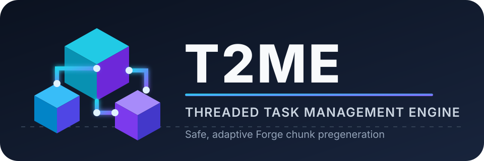

<p align="center">
  
</p>

<h1 align="center">T2ME — Threaded Task Management Engine</h1>

[](https://github.com/MimoAlexer/T2ME/actions/workflows/ci.yml)
[](https://www.minecraft.net/)
[](https://files.minecraftforge.net/net/minecraftforge/forge/index_1.20.1.html)
[](https://adoptium.net/temurin/releases/?version=17)
[](LICENSE)

T2ME is a clean-room, server-side chunk pregenerator for Minecraft Forge
1.20.1. It keeps a bounded pipeline of `FULL` chunk requests moving through
Minecraft's existing task system, saves its progress, and automatically
reduces admission when server health degrades.

The goal is useful throughput **without trading away world safety or server
responsiveness**.

> [!IMPORTANT]
> T2ME is not a Forge port of C2ME or Lithium. It does not replace Minecraft's
> terrain generator or write region files from custom threads. A narrow NBT
> ownership fix isolates chunk reads from pending disk writes. See
> [Architecture](docs/ARCHITECTURE.md) for the exact threading
> boundary.

## Highlights

- Circle or square pregeneration, grouping new jobs by region with Hilbert
  traversal inside each region to improve storage and generation locality.
- Spawn-centered jobs or explicit dimension and block coordinates.
- A bounded pipeline of vanilla/Forge `FULL` chunk futures.
- Adaptive admission that ramps up on healthy ticks and backs off on tick-time
  or heap pressure, with additional protection while players are online.
- Precomputed region counts and allocation-free sequential traversal.
- Existing jobs retain their original spiral order and resume cursor.
- Persistent cursor, progress, failures, retry attempts, and pending coordinates.
- Safe clean-restart recovery with an optional 10-second auto-resume delay.
- Pause, resume, cancel, status, metrics, CPS, and ETA commands.
- Per-request region tickets with cleanup on success, failure, cancellation,
  and normal shutdown.
- Stalled-request detection and bounded retries without silently skipping the
  affected coordinate.
- Validated checkpoints that retain unreadable job data for operator inspection.
- Isolated chunk-load NBT to prevent reloads from mutating a pending save.
- A compatibility guard for known pregenerators and invasive threading mods.
- Server-only installation; unmodified clients can connect.

## Requirements

| Component | Version |
| --- | --- |
| Minecraft | 1.20.1 |
| Forge | 47.4.21 |
| Java | 17 |
| Side | Dedicated or integrated server |

T2ME has no required third-party mod dependency.

## Installation

1. Back up the world and test the backup before pregenerating a large region.
2. Stop the server.
3. Download the T2ME JAR from
   [GitHub Releases](https://github.com/MimoAlexer/T2ME/releases).
4. Place it in the server's `mods` directory.
5. Remove or disable other active pregenerators, then start the server.

Forge creates the configuration at:

```text
<world>/serverconfig/t2me-server.toml
```

T2ME is server-side only. Players do not need the JAR in their client mod
folder.

## Quick start

Generate a circle with a 10,000-block radius around the overworld's current
shared spawn:

```mcfunction
/t2me pregen start 10000 circle
```

Watch progress and scheduler health:

```mcfunction
/t2me status
/t2me metrics
```

Pause safely at any time:

```mcfunction
/t2me pregen pause
```

Then continue the same job:

```mcfunction
/t2me pregen resume
```

Only one T2ME job can be active or paused at a time. Starting a new job is
allowed after the previous one reaches `completed`, `cancelled`, or `failed`.

## Commands

All commands require permission level `4` by default.

| Command | Description |
| --- | --- |
| `/t2me pregen start <radiusBlocks> [circle\|square]` | Start at the overworld's current shared spawn. The default shape is `circle`. |
| `/t2me pregen startat <dimension> <centerX> <centerZ> <radiusBlocks> [circle\|square]` | Start at explicit block coordinates in a loaded dimension. |
| `/t2me pregen pause` | Stop admitting new requests while preserving the job. Existing requests may finish. |
| `/t2me pregen resume` | Resume a paused job if the compatibility guard permits it. |
| `/t2me pregen cancel` | Release T2ME tickets and permanently cancel the current job. |
| `/t2me pregen status` | Show the same detailed job status as `/t2me status`. |
| `/t2me status` | Show state, target, progress, in-flight work, retries, CPS, ETA, throttle reason, and last message. |
| `/t2me metrics` | Add tick EWMA, decaying tick peak, admission limit, heap headroom, player count, and per-job throttle counters to job status. |
| `/t2me config show` | Show the most important live configuration values. |

`radiusBlocks` must be from `16` through `20,000`. The center plus radius must
remain within Minecraft's safe coordinate range. Dimension identifiers use
resource-location syntax, for example:

```mcfunction
/t2me pregen startat minecraft:the_nether 0 0 5000 square
```

## Configuration

Admission starts at four requests and gradually grows toward the configured
ceiling while the server is healthy. Measure MSPT, heap, and player experience
before increasing that ceiling. Existing server configuration files keep their
saved values when upgrading.

| Key | Default | Range | Effect |
| --- | ---: | ---: | --- |
| `scheduler.maxInFlight` | `64` | `1–256` | Ceiling for the adaptive number of simultaneous `FULL` requests. |
| `scheduler.maxDispatchPerTick` | `32` | `1–256` | Maximum new requests admitted at the end of one tick. |
| `scheduler.targetTickMillis` | `45` | `20–100` | Reduce admission when the latest tick or tick EWMA reaches this value. |
| `scheduler.hardStopTickMillis` | `55` | `30–200` | Stop new admission immediately on a latest-tick or EWMA breach; wait for sustained recovery. |
| `scheduler.minHeapHeadroomMiB` | `1024` | `256–8192` | Heap reserve, capped at 25% of maximum heap so small heaps remain usable. |
| `scheduler.stallTimeoutSeconds` | `120` | `30–3600` | Pause the job when the oldest request exceeds this age. |
| `scheduler.reduceWhenPlayersOnline` | `true` | boolean | Halve admission while one or more players are online. |
| `job.maxRetries` | `2` | `0–10` | Retry count per failed coordinate before pausing the job. |
| `job.saveIntervalTicks` | `100` | `20–1200` | How often to mark a running snapshot for persistence. |
| `job.progressLogIntervalSeconds` | `60` | `0–3600` | Periodic status logging; `0` disables it. |
| `job.autoResume` | `true` | boolean | Resume a cleanly interrupted running job 10 seconds after startup. |
| `job.allowCompetingPregenerators` | `false` | boolean | Override the compatibility guard. Use only when the other mod is inactive. |
| `permissionLevel` | `4` | `0–4` | Required permission level for `/t2me`. |

The limit counts outstanding futures, rather than worker threads; it is no
longer capped by processor count. Minecraft controls the worker pool. The
absolute request ceiling is 256, and a hard tick-time stop requires 20 healthy
ticks before admission resumes. See [adaptive admission](docs/ARCHITECTURE.md#adaptive-admission)
for the thresholds and recovery behavior.

## Safety and compatibility

T2ME makes the following guarantees within its own code:

- Chunk tickets, job state, configuration decisions, and completion handling
  are performed on the server thread.
- Its single request-coordinator thread only enters Forge's public
  `getChunkFuture` API and composes the returned future. It does not read or
  mutate chunks.
- Actual terrain generation remains inside Minecraft/Forge's normal worker
  graph.
- Each request uses a job- and issuance-specific ticket identity, preventing a
  late callback from completing a newer job's request.
- A failed coordinate is retried or retained when the job pauses; it is not
  silently counted as complete.
- Retry attempts survive a restart. Invalid checkpoint contents are retained,
  and starting a new job is blocked until the operator explicitly discards them
  with `/t2me pregen cancel` after inspection.

T2ME blocks `start` and `resume` by default when it detects Chunky, C2ME,
C2ME Forge, Chunk Pregenerator, Dimensional Threading, or MCMT. Canary and
ModernFix are detected for reporting but are not blocked.

Canary is complementary on Forge 1.20.1: Canary can provide Lithium-style
engine optimizations while T2ME owns pregeneration admission. Do not run two
pregenerators over the same region at the same time.

For design details and the exact lifecycle, read
[Architecture and safety](docs/ARCHITECTURE.md).

## T2ME, Chunky, Lithium, and Canary

These projects do different jobs. T2ME and Chunky are pregenerators;
Lithium and Canary optimize game-engine logic. There is no honest universal
"faster" winner without a controlled benchmark of the same seed, modpack,
hardware, JVM, and server-health target.

See the [feature-by-feature comparison](docs/COMPARISON.md) for the practical
differences and guidance on choosing a setup.

The [reproducible planner benchmark](benchmarks/README.md) compares the retained
spiral planner with its original algorithm. It checks matching counts and
ordered sequence hashes. New jobs use region order; world-generation throughput
requires a controlled server benchmark, and a faster planner alone cannot
establish a winner against Chunky.
Use the [server comparison harness](docs/BENCHMARKING.md) to measure matching
regions on copies of a prepared world and verify that every target chunk is
saved at `FULL` status.

## Limitations

- Forge 1.20.1 only.
- One T2ME job at a time.
- `circle` and `square` shapes only.
- No trim, delete, world-border import, or selection-management commands.
- No low-level terrain-generation, lighting, entity, AI, redstone, or physics
  optimization patches.
- Previously generated chunks are still requested at `FULL`; they normally
  complete quickly but count toward progress.
- Planning runs on the command thread and precomputes region counts without
  scanning every target chunk.
- Older binaries cannot read region-order checkpoints. Use a pre-upgrade world
  backup for downgrades. Upgrading existing spiral jobs preserves their order.
- Recovery depends on normal Forge world saving. Keep external world backups;
  no mod can protect data from every crash, disk, hardware, or third-party
  failure.

## Build and test

Clone the repository and build with a Java 17 JDK:

```powershell
git clone https://github.com/MimoAlexer/T2ME.git
cd T2ME
.\gradlew.bat clean test build
```

Linux and macOS:

```bash
git clone https://github.com/MimoAlexer/T2ME.git
cd T2ME
./gradlew clean test build
```

The reobfuscated production JAR is written to `build/libs/`.

The unit suite covers deterministic region and spiral traversal, exact shape boundaries,
cursor restoration, checkpoint validation, coordinate limits, admission
recovery, completion handoff, stale ticket identities, retry exhaustion, and
restart requeue ordering.

Run the Forge integration test server separately:

```powershell
.\gradlew.bat runGameTestServer
```

On Linux/macOS, use `./gradlew runGameTestServer`. This exercises real chunk
generation, pause/resume, saved checkpoint reload, cancellation, world saving,
and pending-save NBT isolation. The GameTest sources and fixtures are separate
from the production JAR.

## Project status

T2ME is early software. Treat new releases as operational infrastructure:
test on a copy of the world, review configuration changes, and keep verified
backups.

Bug reports should include the T2ME version, Forge version, relevant
configuration, `/t2me status`, `/t2me metrics`, and a log excerpt:
[open an issue](https://github.com/MimoAlexer/T2ME/issues).

## License and clean-room statement

T2ME is available under the [MIT License](LICENSE).

The implementation does not copy or embed C2ME, Lithium, Canary, or Chunky
code. Those projects remain independent and are governed by their respective
licenses.
