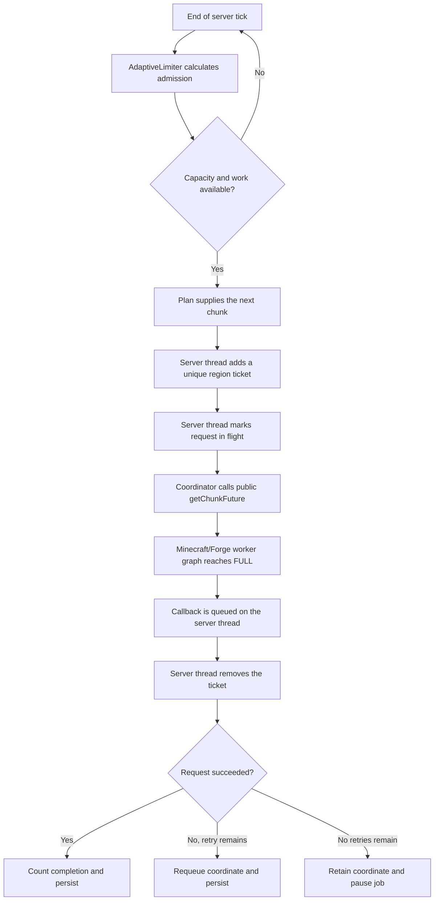
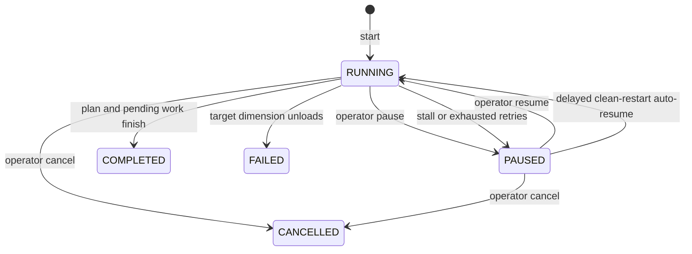

# T2ME architecture and safety

This document describes T2ME 0.1.0 as implemented for Forge 1.20.1. It is
intended for server operators, reviewers, and contributors who need the
threading and persistence model rather than a marketing summary.

## Design goals

T2ME is designed around five constraints:

1. Generate a bounded circle or square from the center outward.
2. Keep several `FULL` chunk requests in flight without blocking the server
   thread on each request.
3. Let Minecraft and Forge perform terrain generation, lighting, and storage
   through their normal task graph.
4. Adapt admission to tick time, memory headroom, CPU availability, and player
   presence.
5. Preserve enough state to continue after a normal restart without skipping
   requests that had not completed.

It is intentionally not a replacement for `ChunkMap`, the chunk-status
pipeline, the region-file layer, or an engine optimization mod.

## Components

| Component | Responsibility |
| --- | --- |
| `T2ME` | Registers server configuration, commands, lifecycle events, and tick callbacks. |
| `T2MECommands` | Defines permission-gated operator commands and validates their arguments. |
| `PregenService` | Owns the active job, tickets, request pipeline, lifecycle, metrics, and persistence boundaries. |
| `PregenJob` | Tracks state, counters, retries, pending and in-flight coordinates, rates, and snapshots. |
| `SpiralChunkPlan` | Deterministically enumerates chunks center-out and filters them against the requested block-space shape. |
| `AdaptiveLimiter` | Calculates the current request-admission limit. |
| `CompatibilityGuard` | Detects known competing pregenerators and invasive threading mods. |
| `T2MEData` | Stores one job snapshot using overworld `SavedData`. |

## Request flow



### Why there is a coordinator thread

On Forge 1.20.1, invoking the public chunk-future request through
`ServerChunkCache` from its main thread can enter a managed blocking path.
T2ME therefore uses one bounded daemon thread named
`T2ME-Request-Coordinator` to enter that public API and obtain/compose its
future.

This coordinator is not a terrain-generation executor. It:

- does not generate or light chunks;
- does not read or mutate a `ServerLevel` or `ChunkAccess`;
- does not add or remove tickets;
- does not update job state or `SavedData`; and
- does not write region files.

All of those responsibilities remain with the server thread or the standard
Minecraft/Forge task graph. The coordinator executor has one thread and a
bounded queue of 32 submissions.

## Thread ownership

| Operation | Owner |
| --- | --- |
| Command handling and plan creation | Server thread |
| Admission decision | Server thread, at tick end |
| Add/remove T2ME region tickets | Server thread |
| Poll the plan and update job state | Server thread |
| Call `getChunkFuture` and compose its returned future | T2ME request coordinator |
| Terrain generation, status transitions, and lighting | Minecraft/Forge task graph |
| Interpret completion and update counters | Server thread |
| Snapshot job state | Server thread through Forge `SavedData` |

The future completion callback captures a ticket identity and schedules its
handler through `MinecraftServer#execute`. The handler ignores completion
against a different job UUID. Tickets additionally include a unique issuance
UUID so a cancelled or retried request cannot collide with a later request for
the same coordinate.

## Planning model

`SpiralChunkPlan` enumerates a deterministic square spiral centered on the
chunk containing the requested block coordinate. A cursor counts inspected
candidates. This makes the traversal resumable with a single `long`.

- `square` accepts any chunk whose block bounds overlap the requested square.
- `circle` accepts any chunk whose block bounds intersect the requested
  block-space circle.

Consequently, boundary chunks are included even when only part of the chunk
lies inside the requested shape. This is deliberate: it avoids gaps at the
edge.

The plan calculates its accepted target count when the job is created. Command
input is limited to a radius of 16–20,000 blocks, and the entire region must
remain inside `±29,999,984` block coordinates.

## Adaptive admission

Every server tick, T2ME records elapsed tick time and updates an exponentially
weighted moving average with an alpha of `0.08`. The base request limit is:

```text
min(configured maxInFlight, clamp(available processors × 2, 2, 32))
```

Admission is then adjusted in this order:

1. Stop when max-heap headroom is below `minHeapHeadroomMiB`.
2. After the initial tick samples, stop when tick EWMA reaches
   `hardStopTickMillis`.
3. Halve the limit when tick EWMA reaches `targetTickMillis`.
4. Halve the resulting limit again when players are online and
   `reduceWhenPlayersOnline` is enabled.

At most `maxDispatchPerTick` new requests are issued in one tick, and never
more than the remaining effective in-flight capacity.

This is backpressure, not a performance guarantee. A modded generator can
still create long ticks after work has already been admitted.

## Job and failure lifecycle



A request failure increments the failure counter and requeues the coordinate
until `maxRetries` is exceeded. At that point, T2ME puts the coordinate back
at the front of the retry queue and pauses. An operator can investigate and
resume without losing that coordinate.

If the oldest in-flight request reaches `stallTimeoutSeconds`, T2ME pauses
admission and records the chunk in the job message. It does not attempt unsafe
future cancellation or force a chunk-state transition.

Pausing stops new admission. Already-issued futures may finish, and their
server-thread callbacks can still advance progress. Cancelling releases all
currently tracked T2ME tickets and clears the active job's queues.

## Persistence and restart recovery

T2ME stores a snapshot in overworld `SavedData` under the name `t2me_jobs`.
The snapshot contains:

- job UUID and state;
- dimension, center, radius, and shape;
- traversal cursor and completion/failure counts;
- creation time and current message; and
- pending coordinates, including requests that were in flight when a normal
  server stop began.

During a normal stop, T2ME releases its region tickets, requeues all in-flight
coordinates, preserves a `RUNNING` state, and marks the snapshot dirty. On the
next server start, a recovered `RUNNING` job is first changed to `PAUSED`. If
`autoResume` is enabled and the compatibility guard is clear, it resumes after
200 server ticks (nominally 10 seconds).

A job that was manually paused or paused by stall/failure handling remains
paused across restart. It does not auto-resume.

Persistence reduces duplicate or skipped work after a clean restart; it is not
a substitute for backups. Abrupt process termination can lose state since the
last world save, and storage or third-party failures remain outside T2ME's
control.

## Compatibility policy

With `allowCompetingPregenerators=false`, T2ME refuses `start` and `resume`
when these known IDs are loaded:

- Pregenerators: `chunky`, `c2me`, `c2me_forge`,
  `chunk_pregenerator`
- Threading mods: `dimthread`, `dimthreads`, `mcmt`

The guard is intentionally conservative. It avoids two independent systems
owning chunk tickets/admission for the same workload and avoids combining T2ME
with mods that substantially alter thread ownership.

Canary and ModernFix are detected and reported but do not block T2ME.
T2ME deliberately leaves Lithium-style engine patches to Canary.

The override exists for expert pack maintainers whose conflicting mod is
installed but operationally inactive. It is not a promise that simultaneous
pregeneration is safe.

## Safety invariants

Changes should preserve all of these invariants:

1. Never directly mutate a world, chunk, ticket, or job from T2ME's
   coordinator thread.
2. Never perform custom region-file I/O.
3. Every issued request receives a unique ticket. Request completion removes
   that ticket, and cancellation or shutdown releases tracked tickets whenever
   the target dimension remains available.
4. Completion is accepted only for the active job and matching issuance.
5. A failed coordinate must be completed, requeued, or visibly retained on a
   paused job—never silently dropped.
6. Persist before claiming restart recoverability.
7. Keep admission bounded independently of operator configuration.

## Known limitations

- One persisted job is supported at a time.
- Only loaded dimensions can be targeted.
- Shape planning and target counting happen synchronously when `start` is
  executed.
- There is no chunk trimming, deletion, selection import/export, or
  world-border integration.
- T2ME does not benchmark, tune, or replace third-party terrain generators.
- T2ME does not patch general server simulation or client rendering.
- It cannot make an already-issued world-generation task preemptible.

See [Comparison](COMPARISON.md) for how this scope differs from Chunky,
Lithium, and Canary.
