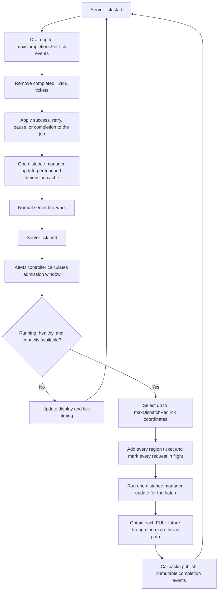
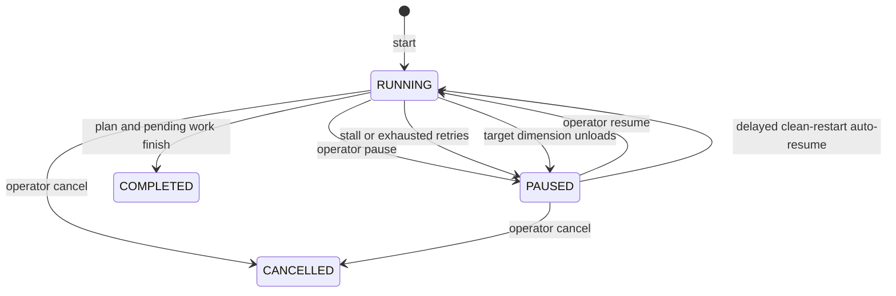

# T2ME 0.2 development architecture

This document describes the experimental `0.2.0-dev.1` implementation for
Forge 1.20.1. It is a code-review document, not a claim that the design is
already faster or safe for production.

T2ME 0.2 changes two different layers:

1. a high-throughput pregeneration scheduler keeps `FULL` chunk futures in
   flight; and
2. a scoped stage engine redirects selected chunk-status generation calls to
   a dedicated worker pool.

The layers are related but not interchangeable. The scheduler decides which
chunks enter the pipeline. The stage engine decides where selected generation
stages for those chunks begin execution.

## Design goals

1. Beat Chunky on the same Forge 1.20.1 pregeneration workload after controlled
   A/B validation.
2. Remove avoidable ticket, distance-manager, callback, and persistence
   overhead from the 0.1 scheduler.
3. Expose more safe world-generation parallelism without moving lighting,
   `FULL` conversion, or region-file ownership into T2ME.
4. Confine the changed stage path to the active T2ME job and its dependencies.
5. Back off quickly when MSPT or heap headroom indicates saturation.
6. Keep pause, retry, ticket cleanup, restart recovery, and visible failure
   semantics.

The release criterion is not "more threads." It is a repeatable throughput
win with equivalent generated work and no unacceptable correctness or health
regression. See [Benchmarking](BENCHMARKING.md).

## Components

| Component | Responsibility |
| --- | --- |
| `T2ME` | Registers configuration, commands, player lifecycle events, server lifecycle events, and tick callbacks. |
| `T2MECommands` | Defines permission-gated commands and sends styled multi-line responses. |
| `PregenService` | Owns the job, ticket pipeline, completion queue, adaptive control loop, display, and persistence boundaries. |
| `PregenJob` | Tracks state, counters, fixed-window rates, latency, retries, pending/in-flight coordinates, and snapshots. |
| `SpiralChunkPlan` | Enumerates chunks center-out, filters the requested shape, and provides batched candidates. |
| `AdaptiveLimiter` | Runs the adaptive request-window controller. |
| `ThreadedWorldgenEngine` | Routes eligible chunk stages to the T2ME worker pool while a matching scope is active. |
| `NeighborhoodLockManager` | Provides asynchronous multi-coordinate exclusion without blocking worker threads. |
| `ChunkStatusMixin` | Redirects only the vanilla generation-task call through the stage engine for eligible work. |
| `ServerChunkCacheAccessor` | Invokes the server-thread future and distance-manager methods used for batched admission. |
| `PregenDisplay` | Owns the server boss bar and viewer reconciliation. |
| `PregenComponents` / `PregenView` | Create a single presentation snapshot used by chat and the boss bar. |
| `CompatibilityGuard` | Detects known competing pregenerators and invasive threading mods. |
| `T2MEData` | Stores one job snapshot through overworld `SavedData`. |

## Scheduler data flow



### Why direct main-thread access is used

T2ME 0.1 entered the public `ServerChunkCache#getChunkFuture` path through a
single coordinator thread. That introduced an off-thread handoff and
managed-blocking path for every requested chunk.

T2ME 0.2 is already executing admission at tick end on the server thread. It
therefore uses Mixin invokers to:

1. add all T2ME region tickets for a batch;
2. call `runDistanceManagerUpdates` once so the corresponding holders exist;
3. call `getChunkFutureMainThread(x, z, FULL, false)` for every item; and
4. attach a callback that only publishes a completion event.

`create=false` is intentional: the region ticket and distance-manager pass
must create the holder before the future is requested. If that assumption is
violated, the result is handled as a visible failed request.

This path removes repeated distance-manager passes and the coordinator
round-trip, but it relies on private Minecraft implementation details exposed
through Mixins. That is one reason the branch is experimental and restricted
to the exact supported Minecraft/Forge version.

### Completion queue

Chunk futures may finish on several Minecraft or T2ME workers. Their callbacks
must not mutate job state or tickets. They append immutable `CompletionEvent`
values to a `ConcurrentLinkedQueue`, which is used as a multi-producer,
single-consumer queue in this design.

At tick start, the server thread drains at most
`maxCompletionsPerTick` events. It:

- removes the matching region ticket;
- rejects stale callbacks whose job UUID or issuance number no longer matches;
- updates success, retry, failure, and latency counters;
- performs one distance-manager update per touched chunk cache; and
- persists only meaningful state transitions immediately.

Periodic `SavedData` snapshots remain controlled by `saveIntervalTicks`.
This avoids one server task and one persistence operation per completed
future.

## Adaptive request window

The controller uses additive-increase/multiplicative-decrease behavior. Its
defaults are:

```text
minimum window:          32 futures
initial window:          64 futures
configured maximum:     384 futures
control interval:        20 ticks
target tick EWMA:        48 ms
hard-stop tick EWMA:     65 ms
minimum heap headroom:  512 MiB
```

The configured maximum is also capped from the JVM maximum heap:

```text
heap window = min(512, maxHeapGiB * 24)
effective maximum = min(configured maximum, max(64, heap window))
```

The controller initializes at the configured initial window, clamped between
the effective bounds. On control ticks:

- healthy, at-least-75%-occupied pipelines add `max(4, processor count)` to
  the window;
- throughput improvements update the remembered best window;
- a fall below 85% of the remembered best throughput can restore that best
  window after significant overshoot;
- exceeding target MSPT multiplies the window by `0.8`;
- exceeding hard-stop MSPT multiplies the internal window by `0.5` and returns
  zero admission;
- insufficient heap headroom also halves the internal window and returns zero
  admission; and
- optional player protection halves admission when players are online.

The tick EWMA uses alpha `0.08`. The decaying peak and scheduler reason are
reported for diagnosis.

The controller searches for a useful queue depth; it does not choose the
number of world-generation workers. A larger future window can keep a worker
graph busy, but beyond the hardware's saturation point it can reduce
throughput through memory pressure, garbage collection, lock contention, or
storage contention.

## Stage-aware world-generation engine

`ChunkStatusMixin` redirects only the `GenerationTask#doWork` invocation
inside `ChunkStatus#generate`. Vanilla retains ownership of profiling, future
composition, and status publication. The redirect asks
`ThreadedWorldgenEngine` whether a stage is eligible and immediately invokes
the original task/executor when it is not.

The engine is active only when:

- `threadedWorldgen.enabled=true`;
- a T2ME job is running, or its already admitted work is still in flight;
- the chunk belongs to the job's dimension;
- the chunk center is inside the circle or square plus a 12-chunk dependency
  margin; and
- the current `ChunkStatus` is enabled for threading.

### Default stage policy

| Stage | Default | Lock radius | Notes |
| --- | --- | ---: | --- |
| `STRUCTURE_STARTS` | Native | `0` when opted in | Structure mods can retain shared mutable state. |
| `STRUCTURE_REFERENCES` | Native | `0` when opted in | Controlled by `threadedWorldgen.structures`. |
| `BIOMES` | Threaded | `0` | Runs through the T2ME worker pool. |
| `NOISE` | Threaded | `0` | Primary terrain-fill candidate. |
| `SURFACE` | Threaded | `0` | Runs through the T2ME worker pool. |
| `CARVERS` | Threaded | `0` | Runs through the T2ME worker pool. |
| `FEATURES` | Native | `1` when opted in | Highest-risk switch for modded generators. |
| `SPAWN` | Threaded | `0` | Runs through the T2ME worker pool. |
| Lighting | Native | Not applicable | Never redirected by T2ME. |
| `FULL` conversion | Native | Not applicable | Never redirected by T2ME. |

A radius-zero lock excludes another T2ME-managed stage for the same chunk
coordinate. A radius-one lock reserves the 3-by-3 chunk neighborhood.

### Worker pool

With `threadedWorldgen.threads=0`, the worker count is:

```text
clamp(available processors - 1, 2, 64)
```

An explicit value is clamped to `1-64`. Workers are daemon threads named
`T2ME-Worldgen-N`, run one priority below normal, and are prestarted.

The executor has a fixed worker count, but its current
`LinkedBlockingQueue` is not size-bounded. Overall demand is indirectly
limited by the adaptive in-flight window. Queue depth is exposed in
`/t2me metrics`; a future hard queue bound remains a candidate if benchmarks
show excessive queued stages.

## Asynchronous neighborhood locks

The lock manager maintains a tail future for each packed chunk coordinate.
Acquiring several coordinates:

1. installs one release future as the new tail for every requested key while
   holding a short monitor;
2. deduplicates and waits for all prior tails without parking a worker;
3. produces one idempotent token; and
4. removes only tails that still point to that token when it closes.

Because the whole key set is reserved in one monitor section, two overlapping
neighborhoods cannot deadlock through different acquisition orders. The token
is closed on normal completion, stage failure, and executor rejection.

This lock coordinates only work routed through T2ME. It cannot serialize
unrelated mutable state inside an arbitrary third-party generator, which is
why structures and features remain opt-in.

## Thread ownership

| Operation | Owner |
| --- | --- |
| Commands, plan creation, and job transitions | Server thread |
| Adaptive admission decision | Server thread at tick end |
| Add/remove T2ME region tickets | Server thread |
| Distance-manager updates for T2ME batches | Server thread |
| Obtain `FULL` futures through the main-thread chunk-cache method | Server thread |
| Publish immutable completion events | Any future-completion thread |
| Drain completion events and update counters | Server thread |
| Eligible stage entry | Fixed T2ME worldgen worker pool |
| Eligible stage task and its supplied executor | T2ME worker pool, with inline execution for nested work already on a T2ME worker |
| Other composed continuations | Executor selected by Minecraft, Forge, or the installed generator |
| Lighting and `FULL` conversion | Native Minecraft/Forge path |
| Region-file I/O | Native Minecraft/Forge path |
| Snapshot job state | Server thread through Forge `SavedData` |
| Boss-bar updates and viewers | Server thread |

T2ME does not assert that an entire stage future remains on one T2ME thread.
It invokes the stage action on its worker; the returned future may compose
continuations on executors chosen by Minecraft, Forge, or the generator.

## Planning model

`SpiralChunkPlan` enumerates a deterministic square spiral centered on the
chunk containing the requested block coordinate. A `long` cursor counts
inspected candidates, making traversal restartable. Batch polling avoids
repeated per-item setup.

- `square` accepts chunks whose block bounds overlap the requested square.
- `circle` accepts chunks whose block bounds intersect the requested
  block-space circle.

The optimized target counter is linear in the chunk radius for circles and
constant-time for squares. Boundary chunks are included when any part
intersects the requested region, preventing edge gaps.

Command input is limited to a radius of `16-20,000` blocks, and the complete
region must remain within Minecraft's safe coordinate range.

## Job and failure lifecycle



A failed request is requeued until `job.maxRetries` is exceeded. The failing
coordinate is retained at the front of the retry queue when the job pauses.

If the oldest in-flight request reaches `stallTimeoutSeconds`, T2ME:

1. removes all tracked T2ME tickets;
2. runs one distance-manager update;
3. requeues every in-flight coordinate; and
4. pauses with a visible coordinate and age.

Pausing stops new admission but does not cancel already issued futures.
Cancelling releases tracked tickets and rejects late completion events through
job/issuance identity checks.

If the target dimension becomes unavailable, T2ME requeues its tracked
in-flight coordinates, deactivates the scoped stage engine, and pauses until
an operator reloads the dimension and resumes the job.

## Persistence and restart recovery

The job snapshot is stored in overworld `SavedData` as `t2me_jobs`. It
contains:

- job UUID and state;
- dimension, center, radius, and shape;
- traversal cursor and completion/failure counters;
- creation time and current message; and
- pending coordinates, including active requests requeued during normal stop;
  and
- per-coordinate retry counts, so a restart does not reset a failing chunk's
  retry budget.

On normal server stop, T2ME releases its tickets, requeues active coordinates,
preserves the running snapshot, stops the worker pool, and clears transient
completion events. On the next start, a recovered `RUNNING` job first becomes
`PAUSED`; with `job.autoResume=true`, it resumes after 200 ticks only if the
compatibility guard is clear.

This is operational recovery, not crash-proof transactional storage. A hard
process or machine failure can lose progress since the last world save.

## Display model

`PregenView` is an immutable snapshot. Both commands and the boss bar consume
it, preventing independently formatted values from disagreeing.

The boss bar refreshes every 10 ticks by default and reconciles viewers every
100 ticks. All players see it by default; the config can restrict it to users
with the T2ME permission level. Completed, cancelled, and failed results stay
visible for 200 ticks.

Chat status is split into:

- progress and percentage;
- dimension, center, shape, and radius;
- five-second and 60-second rates plus ETA;
- active, retrying, and failed work;
- worker, stage-queue, lock, and adaptive-window state; and
- throttle reason, MSPT, latency, and job identity.

## Compatibility policy

With `job.allowCompetingPregenerators=false`, `start` and `resume` are blocked
when T2ME detects:

- `chunky`
- `c2me`
- `c2me_forge`
- `chunk_pregenerator`
- `dimthread` / `dimthreads`
- `mcmt`

Canary and ModernFix are reported but do not block startup. This policy cannot
prove compatibility with an unknown mod; it only prevents known double
ownership.

## Required invariants

Changes to the dev engine must preserve these invariants:

1. Job state, `SavedData`, and T2ME ticket mutation stay on the server thread.
2. A completion is accepted only for the active job and matching issuance.
3. Every admitted request is completed, requeued, or visibly retained; it is
   never silently dropped.
4. Every tracked ticket is removed on completion, cancellation, stall, or
   normal shutdown when its dimension remains available.
5. T2ME does not implement custom region-file I/O.
6. Lighting and `FULL` conversion remain native.
7. Stage threading remains scoped to the active job area and configured
   statuses.
8. Structures and `FEATURES` stay off by default until the target modpack
   passes semantic parity and stress tests.
9. Request admission and completion draining remain bounded per tick.
10. No performance claim is published before the benchmark gate passes.

## Known limitations and open risks

- This branch overwrites `ChunkStatus#generate`, a compatibility-sensitive
  method targeted by performance and world-generation mods.
- The stage executor queue is not explicitly size-bounded.
- Radius-zero locks do not protect cross-chunk mutable generator state.
- The active-scope margin is fixed at 12 chunks and may not cover every custom
  generator's nonstandard dependency behavior.
- One persisted job is supported at a time.
- Only loaded dimensions can be targeted.
- T2ME has no trim, delete, selection import/export, or world-border tools.
- A larger request window can make performance worse on memory-, disk-, or
  lock-bound servers.
- No mod can guarantee world integrity in every third-party mod combination.

See [Comparison](COMPARISON.md) for project scope and
[Benchmarking](BENCHMARKING.md) for the required evidence.
