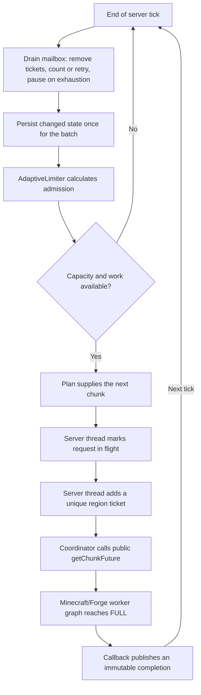
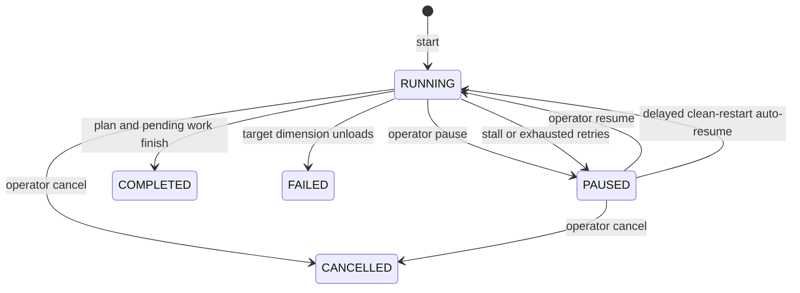

# T2ME architecture and safety

This document describes T2ME 0.2.0 as implemented for Forge 1.20.1. It is
intended for server operators, reviewers, and contributors who need the
threading and persistence model rather than a marketing summary.

## Design goals

T2ME is designed around five constraints:

1. Generate a bounded circle or square from the center outward.
2. Keep several `FULL` chunk requests in flight without blocking the server
   thread on each request.
3. Let Minecraft and Forge perform terrain generation, lighting, and storage
   through their normal task graph.
4. Adapt admission to tick time, memory headroom, and player
   presence.
5. Preserve enough state to continue after a normal restart without skipping
   requests that had not completed.

It is intentionally not a replacement for `ChunkMap`, the chunk-status
pipeline, the region-file layer, or an engine optimization mod.

## Components

| Component | Responsibility |
| --- | --- |
| `T2ME` | Registers server configuration, commands, lifecycle events, and tick callbacks. |
| `T2MECommands` | Defines permission-gated operator commands and validates their arguments. |
| `PregenService` | Owns the active job, tickets, request pipeline, lifecycle, metrics, and persistence boundaries. |
| `PregenJob` | Tracks state, counters, retries, pending and in-flight coordinates, rates, and snapshots. |
| `SpiralChunkPlan` | Deterministically enumerates chunks center-out and filters them against the requested block-space shape. |
| `AdaptiveLimiter` | Calculates the current request-admission limit. |
| `CompletionMailbox` | Transfers immutable completion results to the server tick and discards late results after closure. |
| `CompatibilityGuard` | Detects known competing pregenerators and invasive threading mods. |
| `T2MEData` | Stores one job snapshot using overworld `SavedData`. |
| Chunk-load NBT mixin | Gives load consumers their own NBT object instead of exposing data shared with a pending disk write. |

## Request flow

```mermaid
flowchart TD
    A["End of server tick"] --> O["Drain mailbox: remove tickets, count or retry, pause on exhaustion"]
    O --> P["Persist changed state once for the batch"]
    P --> B["AdaptiveLimiter calculates admission"]
    B --> C{"Capacity and work available?"}
    C -- "No" --> A
    C -- "Yes" --> D["Plan supplies the next chunk"]
    D --> E["Server thread marks request in flight"]
    E --> F["Server thread adds a unique region ticket"]
    F --> G["Coordinator calls public getChunkFuture"]
    G --> H["Minecraft/Forge worker graph reaches FULL"]
    H --> I["Callback publishes an immutable completion"]
    I -- "Next tick" --> A
```

### Why there is a coordinator thread

On Forge 1.20.1, invoking the public chunk-future request through
`ServerChunkCache` from its main thread can enter a managed blocking path.
T2ME therefore uses one bounded daemon thread named
`T2ME-Request-Coordinator` to enter that public API and obtain/compose its
future.

This coordinator is not a terrain-generation executor. It:

- does not generate or light chunks;
- does not read or mutate a `ServerLevel` or `ChunkAccess`;
- does not add or remove tickets;
- does not update job state or `SavedData`; and
- does not write region files.

All of those responsibilities remain with the server thread or the standard
Minecraft/Forge task graph. The coordinator executor has one thread and a
bounded queue of 256 submissions.

## Thread ownership

| Operation | Owner |
| --- | --- |
| Command handling and plan creation | Server thread |
| Admission decision | Server thread, at tick end |
| Add/remove T2ME region tickets | Server thread |
| Poll the plan and update job state | Server thread |
| Call `getChunkFuture` and compose its returned future | T2ME request coordinator |
| Terrain generation, status transitions, and lighting | Minecraft/Forge task graph |
| Publish immutable completion result | Future completion thread, through the mailbox |
| Interpret completion and update counters | Server thread |
| Snapshot job state | Server thread through Forge `SavedData` |

The future completion callback captures a ticket identity and publishes a small
immutable result to the current job's mailbox. The server drains the mailbox at
tick end and before detach, then snapshots the resulting changes once for the
whole batch. Workers never fall back to executing completion handlers directly
when the server stops. Closing a mailbox discards its queued and future results;
normal cancellation and detach release tickets and retain or cancel pending work
on the server thread.

The completion handler ignores a different job UUID. Tickets additionally
include a unique issuance UUID so a cancelled or retried request cannot collide
with a later request for the same coordinate.

## Chunk-load NBT ownership

Minecraft 1.20.1's `IOWorker.loadAsync` can return the exact `CompoundTag`
held by a pending write. `ChunkStorage.upgradeChunkTag` then adds and removes
the root `__context` key. If the I/O worker is serializing the same tag,
iteration can fail with `ConcurrentModificationException`. A larger
pregeneration test exposed this during chunk unloading and reloading.

T2ME wraps the load result with a synchronous continuation that deep-copies
present NBT. Each load operation can then upgrade its own tag without mutating the
pending writer's object. Empty results and exceptional completion retain their
normal behavior. This also covers loads unrelated to T2ME while the mod is
installed. It adds no executor and performs no region-file I/O itself.

The mixin is required: a missing target causes startup to fail rather than
silently omitting the ownership fix. Forge integration tests verify the
transformed runtime, and packaged-server benchmarks check the reobfuscated
JAR. This is a narrowly scoped storage correctness fix, not a terrain
generation algorithm change.

## Planning model

`SpiralChunkPlan` enumerates a deterministic square spiral centered on the
chunk containing the requested block coordinate. A cursor counts inspected
candidates. This makes the traversal resumable with a single `long`.

- `square` accepts any chunk whose block bounds overlap the requested square.
- `circle` accepts any chunk whose block bounds intersect the requested
  block-space circle.

Consequently, boundary chunks are included even when only part of the chunk
lies inside the requested shape. This is deliberate: it avoids gaps at the
edge.

Square target counting is constant time. Circle construction calculates an
inclusive X interval for each chunk row using the nearest block Z and an exact
integer square root. Construction and storage are proportional to the row
count, with at most 2,501 rows under the 20,000-block radius limit. Membership
checks then use those intervals in constant time.

Sequential traversal increments integer coordinates without allocating a
coordinate object or calculating a square root for every candidate. Lookahead
caches the next accepted chunk without changing the persisted cursor. Cursor
restoration and shape semantics remain compatible with 0.1 checkpoints.
Checkpoint coverage can be counted from the completed inner square and partial
outer ring in time proportional to chunk rows, without scanning the region.

Command input is limited to a radius of 16–20,000 blocks, and the entire region
must remain inside `±29,999,984` block coordinates. See the
[standalone planner benchmark](../benchmarks/README.md) for a reproducible
comparison with the original planner implementation.

## Adaptive admission

Every server tick, T2ME records the latest elapsed tick time and updates an
exponentially weighted moving average with an alpha of `0.08`. The measurement
includes completion handling and the previous tick's admission, snapshot and
logging work, so scheduler overhead contributes to backpressure. A new job starts
with a request window of four, or its configured ceiling if lower. The default
ceiling is 32 and the absolute ceiling is 256. This is a count of futures;
Minecraft owns worker allocation, so processor count does not cap the window.

Admission is adjusted in this order:

1. Stop below the configured heap reserve, capped at 25% of maximum heap.
   Resume only when an additional recovery margin is available. That margin is
   the smaller of 1/16 of maximum heap and the greater of 16 MiB or 1/8 of the
   reserve.
2. Stop immediately when either the latest tick or EWMA reaches
   `hardStopTickMillis`. Require 20 consecutive ticks with both measurements at
   or below 90% of the target before resuming. Restore at most four requests,
   never more than the pre-stop window or current configured ceiling. Any
   intervening heap pressure forces recovery at one request.
3. Halve the window when either tick measurement reaches `targetTickMillis`,
   at most once every five recorded ticks. If thresholds are reversed, use
   `hardStopTickMillis - 1` as the effective target.
4. While a job is running and both measurements remain at or below 90% of the
   target, grow the window every ten ticks by roughly one quarter, bounded to
   an increase of one through eight and the configured ceiling.
5. Halve the effective admission limit while players are online and
   `reduceWhenPlayersOnline` is enabled, retaining a minimum of one unless a
   hard stop is active.

Idle and paused jobs do not grow the window. Repeated decision queries within
one tick cannot advance the controller. Heap pressure resets the window to one
and uses a separate recovery margin to avoid oscillating around the threshold.

At most `maxDispatchPerTick` new requests are issued in one tick, and never
more than the remaining effective in-flight capacity.

This is backpressure, not a performance guarantee. A modded generator can
still create long ticks after work has already been admitted.

## Job and failure lifecycle

```mermaid
stateDiagram-v2
    [*] --> RUNNING: start
    RUNNING --> PAUSED: operator pause
    RUNNING --> PAUSED: stall or exhausted retries
    RUNNING --> COMPLETED: plan and pending work finish
    RUNNING --> CANCELLED: operator cancel
    PAUSED --> RUNNING: operator resume
    PAUSED --> RUNNING: delayed clean-restart auto-resume
    PAUSED --> CANCELLED: operator cancel
    RUNNING --> FAILED: target dimension unloads
```

A request failure increments the failure counter and requeues the coordinate
until `maxRetries` is exceeded. At that point, T2ME puts the coordinate back
at the front of the retry queue and pauses. An operator can investigate and
resume without losing that coordinate.

If the oldest in-flight request reaches `stallTimeoutSeconds`, T2ME pauses
admission and records the chunk in the job message. It does not attempt unsafe
future cancellation or force a chunk-state transition.

Pausing stops new admission. Already-issued futures may finish, and their
server-thread completion handling can still advance progress. Cancelling releases all
currently tracked T2ME tickets and clears the active job's queues.

## Persistence and restart recovery

T2ME stores a snapshot in overworld `SavedData` under the name `t2me_jobs`.
The snapshot contains:

- job UUID and state;
- dimension, center, radius, and shape;
- traversal cursor and completion/failure counts;
- creation time and current message; and
- pending coordinates and their retry attempts, including requests that were
  in flight or polled for dispatch when a normal server stop began.

The optional retry fields preserve the existing 0.1 snapshot layout. A valid
older snapshot is still accepted, with unknown prior retry counts starting at
zero. New snapshots preserve attempts across restarts; retry exhaustion pauses
the job while retaining its coordinate for an explicit operator resume.

Loading validates field types, dimensions, bounds, cursor range, counters,
pending-coordinate uniqueness and membership, retry references, and coverage of
all accepted candidates before the cursor. A checkpoint that would silently
lose visited chunks is rejected. Invalid original job data is retained on disk
and reported by `/t2me status`; starting another job is blocked. After inspecting
or backing up that data, an operator can explicitly discard it using
`/t2me pregen cancel`.

During a normal stop, T2ME releases its region tickets, requeues all in-flight
coordinates, preserves a `RUNNING` state, and marks the snapshot dirty. On the
next server start, a recovered `RUNNING` job is first changed to `PAUSED`. If
`autoResume` is enabled and the compatibility guard is clear, it resumes after
200 server ticks (nominally 10 seconds).

A job that was manually paused or paused by stall/failure handling remains
paused across restart. It does not auto-resume.

Completion metrics use fixed-size time buckets rather than retaining an object
for every completion. Successful requests release their retry history. Snapshot
cost is proportional to current pending work rather than completed world area.

Persistence reduces duplicate or skipped work after a clean restart; it is not
a substitute for backups. Abrupt process termination can lose state since the
last world save, and storage or third-party failures remain outside T2ME's
control.

## Compatibility policy

With `allowCompetingPregenerators=false`, T2ME refuses `start` and `resume`
when these known IDs are loaded:

- Pregenerators: `chunky`, `c2me`, `c2me_forge`,
  `chunk_pregenerator`
- Threading mods: `dimthread`, `dimthreads`, `mcmt`

The guard is intentionally conservative. It avoids two independent systems
owning chunk tickets/admission for the same workload and avoids combining T2ME
with mods that substantially alter thread ownership.

Canary and ModernFix are detected and reported but do not block T2ME.
T2ME deliberately leaves Lithium-style engine patches to Canary.

The override exists for expert pack maintainers whose conflicting mod is
installed but operationally inactive. It is not a promise that simultaneous
pregeneration is safe.

## Safety invariants

Changes should preserve all of these invariants:

1. Never directly mutate a world, chunk, ticket, or job from T2ME's
   coordinator thread.
2. Never perform custom region-file I/O.
3. Every issued request receives a unique ticket. Request completion removes
   that ticket, and cancellation or shutdown releases tracked tickets whenever
   the target dimension remains available.
4. Completion is accepted only for the active job and matching issuance.
5. A failed coordinate must be completed, requeued, or visibly retained on a
   paused job—never silently dropped.
6. Persist before claiming restart recoverability.
7. Keep admission bounded independently of operator configuration.

## Known limitations

- One persisted job is supported at a time.
- Only loaded dimensions can be targeted.
- Shape planning happens on the command thread, using constant-time square
  counting or at most 2,501 circle rows.
- There is no chunk trimming, deletion, selection import/export, or
  world-border integration.
- T2ME does not benchmark, tune, or replace third-party terrain generators.
- T2ME does not patch general server simulation or client rendering.
- It cannot make an already-issued world-generation task preemptible.

See [Comparison](COMPARISON.md) for how this scope differs from Chunky,
Lithium, and Canary.
